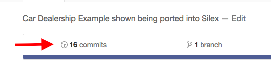

# The Completed Car Dealership in Silex

#### _This is a walkthrough of the Car Dealership Example from Epicodus Week 1 of PHP_

#### By _**Diane Douglas**_

## Description

This repository is intended as a way to check your work as you go, but only if you get lost. 

Do your best to complete this project on your own, but if you get stuck, take a look at the commit history on this repository to see the steps involved.

Remember that you can click on the number of commits to view the history with all messages:

Then you can click on a single commit's `<>` button on the far right to click around in the repository at that point in time.

## Your Steps

To follow along you should:

* [Start with this lesson to create a basic Car class with properties.](https://www.learnhowtoprogram.com/php/object-oriented-php-prep/objects-and-properties)
* [Move on to this one to see how to add a method for seeing if the car is worth buying.](https://www.learnhowtoprogram.com/php/object-oriented-php-prep/objects-and-methods-a904a2f4-7df1-4640-95a8-34798b1f8f45)
* From here, [follow this lesson](https://www.learnhowtoprogram.com/php/object-oriented-php/objects-in-silex) to start the Silex project structure. Only instead of loading a Rectangle class declaration from the `src` folder, we want a Car class.
* We should also follow [this lesson](https://www.learnhowtoprogram.com/php/object-oriented-php-prep/constructors-in-php) to add a constructor to our Car class, and then [this one](https://www.learnhowtoprogram.com/php/object-oriented-php-prep/encapsulation-and-visibility-in-php) to add getters, setters and private properties. Then we'll have a complete Car class.
* Now, in your Silex app, instantiate a Car object and display it on a route.
* Then, create a new property on the Car class for a picture of the Car. Don't forget to include it in the constructor with a getter and a setter.
* Create a new route in app.php to show your array of cars from your original Car.php file. Only now, instantiate cars with your constructor. Don't forget the pictures! 
* Add a route for your price form, and move it over from car_form.html
* Inside the /cars route, get the user's desired price out of the form. 
* Use the price value and call the `worthBuying` method on each car in your /cars route so that you only display the cars matching the user's search criteria.
* Expand the search to include mileage. We will need a second form field because users only want cars under a certain price and mileage.
* Edit the `worthBuying` method to include the second search parameter.
* Modify the call to the `worthBuying` method so that we pass it both pieces of information it needs to do its job. The price and the mileage. 
* Finally add an if statement so that the user doesn't see a blank page if they can't find any car objects worth buying.

** Celebrate.
